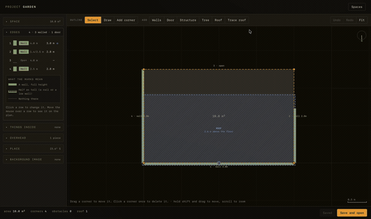
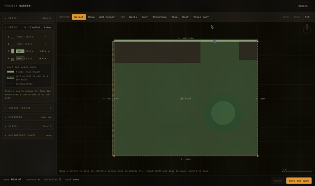
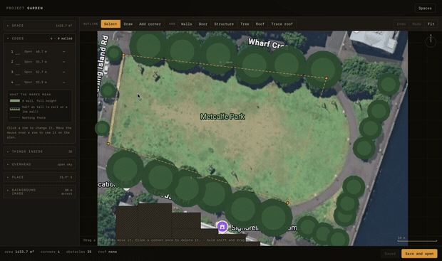
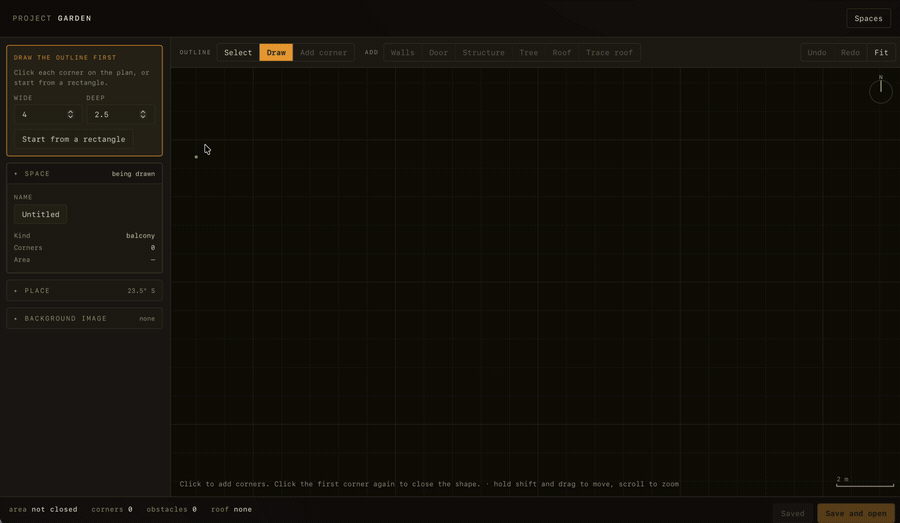
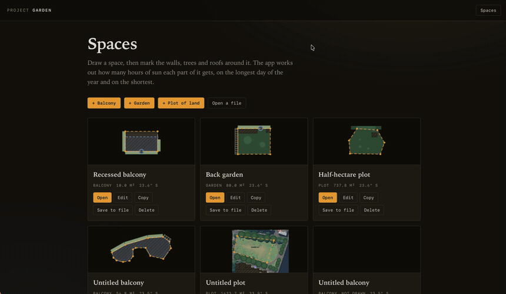
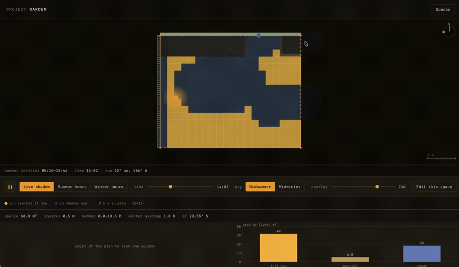

# Project Garden

Draw a space. The app works out how many hours of sun each part of it gets.

I built this to answer one question about my own balcony, so it is a personal
tool, not a product. It runs in the browser, keeps everything in your own
browser storage, and has no accounts and no server.

<table>
  <tr>
    <td width="33%"></td>
    <td width="33%"></td>
    <td width="33%"></td>
  </tr>
  <tr>
    <td><sub>A balcony. Walls on three sides and a roof over part of it.</sub></td>
    <td><sub>A garden. A house and a tree get in the way.</sub></td>
    <td><sub>A plot of land, drawn over a photo.</sub></td>
  </tr>
</table>

```bash
npm install
npm run dev
```

Then open the address it prints. Three example spaces are already there.

## You can create your own places

Click each corner, or start from a rectangle. It snaps to other corners, to
right angles, and to 10 cm. Then say what is around it and what is in it:

- Each edge is a wall, a half-height wall, or nothing. A wall has a height, and
  it can run only part of the way along the edge — the rest lets light in.
- Sheds, walls and raised beds block the ground under them. Trees do not.
- The roof can be as many pieces as the real roof has, each with its own shape
  and height. Pieces may overlap and may reach past the walls, the way an eave
  does.



## You can trace an existing image

Drop in a photo taken from above, or a screenshot of a map. Draw a line on
something you know the length of, type that length, and the image is now to
scale. Everything you draw on top of it is in real metres.

If you know the coordinates of two points in the picture, you can give it those
instead. That sets the scale, which way north is, and the latitude, all at once.



## You can get details on the sun

Watch the shadows move through the day, or see the totals for the longest and
the shortest day of the year. Point at any square to get that square on its own:
hours of sun in summer and in winter, when during the day the sun reaches it,
how sheltered it is, and how near a door it is.



## How the numbers are worked out

Everything is in metres. `+x` is east, `+y` is north.

- **Where the sun is.** Real solar position: declination from the day of the
  year, hour angle from the time, then altitude and azimuth. Sunrise and sunset
  come from the hour angle, so the animation always starts and ends with the sun
  on the horizon, at any latitude.
- **Shadows.** Anything that casts shade is a flat outline with a height. Its
  shadow is that outline moved `height / tan(altitude)` away from the sun. A
  wall shades the band between its base and the far end; a roof only moves,
  because it is not standing on the ground.
- **Hours of sun.** The space is cut into squares. For the longest and the
  shortest day of the year, every half hour, each square is either in a shadow
  or not. Half an hour of sun is added each time it is not.

### What it does not do

- No sloped roofs. Everything is a flat outline at one height.
- Trees are solid. No light comes through a canopy.
- No bounced light, no light from a bright sky — only direct sun.
- No clouds, and no local weather.
- Hard shadow edges, with no soft edge.
- The ground is flat, and so is the earth over the size of one garden.

So treat the numbers as a good guess, not a survey.

## Layout

| Folder | What is in it |
| --- | --- |
| `src/space` | The saved data: types, browser storage, migration, coordinates |
| `src/view` | Canvas drawing and the metres ↔ pixels transform |
| `src/engine` | The sun and shadow maths. No React, no canvas, no DOM |
| `src/editor` | Drawing a space |
| `src/studio` | Looking at the result |
| `src/app` | Screens, routing, the background worker |
| `docs` | The design notes this was built from |

The engine is plain functions over plain data, so it is tested without a browser
and can run in a worker. A lint rule stops it importing React.

```bash
npm test          # the maths and the data model
npm run lint
npm run build
```

## Saving

Spaces live in browser storage under one key. Nothing leaves your machine. Use
**Save to file** to get a `.json` you can keep or move, and **Open a file** to
read one back.

Browser storage is about 5 MB in total, and a background image is large, so
images are shrunk to 1600 px on the long side before saving.

## Making the pictures above

Record with **Cmd-Shift-5**, then convert. Recordings are not committed — only
the GIFs are.

```bash
scripts/mov-to-gif.sh balcony.mov docs/media/balcony.gif 620 12
scripts/mov-to-gif.sh garden.mov  docs/media/garden.gif  620 10 1.4
scripts/mov-to-gif.sh tracing-image.mov docs/media/tracing.gif 860 10 3.5
```

The arguments after the filenames are width in pixels, frames per second, and
speed. Speed 3.5 plays a 76-second clip in 22 seconds, which is how a long
recording stays small enough to sit in a README.

The script runs ffmpeg twice: once to pick the best 256 colours for that clip,
once to write the GIF with them. One pass looks banded on a dark background. It
also drops all metadata, because a macOS recording carries a creation timestamp
and the recorder's name.

What keeps the files small:

- The three at the top are only 620 px wide, because they are shown three across
  and get scaled down anyway. The full-width ones are 860–900 px.
- 10 to 12 frames per second is enough. The shadow animation is slow on purpose.
- Speed up anything over about 20 seconds rather than cutting the width further.
- Record just the browser window, not the whole screen.

Everything above adds up to about 8 MB.

## Security notes

- Every dependency is pinned to an exact version, and `npm ci` installs only
  what the lockfile says.
- `.npmrc` sets `ignore-scripts=true`, so no package can run code while
  installing.
- GitHub Actions are pinned to a commit, not a tag, because a tag can be moved.
- The built page carries a strict content security policy. It loads nothing from
  anywhere else, and there is nothing to load. `public/_headers` has the same
  policy for hosts that can send real headers.

See `SECURITY.md`.

## Licence

GNU Affero General Public License v3.0. See `LICENSE`.

In short: use it, change it, share it. If you run a changed copy where other
people can use it, including over a network, you have to offer them the source
of your changes under the same licence.
